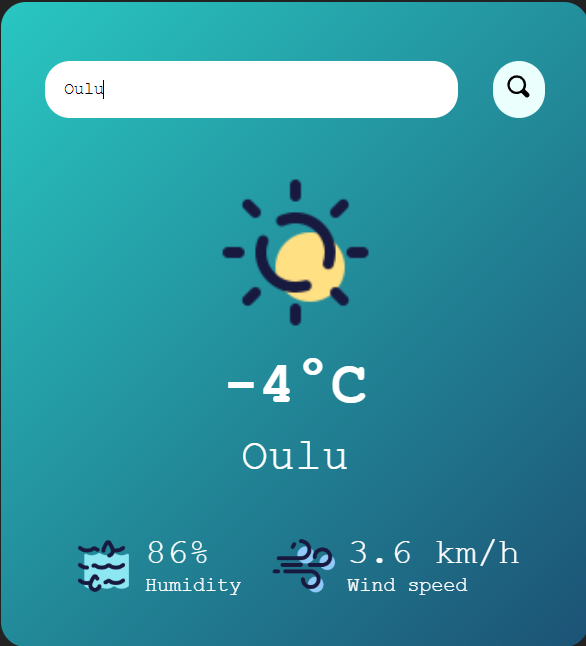

Hello, this is my little weather project.(only using HTML, CSS and Javascript).
How to use: Enter the name of city or country (English name) to the input box and "Enter" or click the button next to it to get the weather.
This project use API from OpenWeather(https://openweathermap.org/api) to get the weather.
Here is the link to my project (https://san1577.github.io/Weather-App/)

